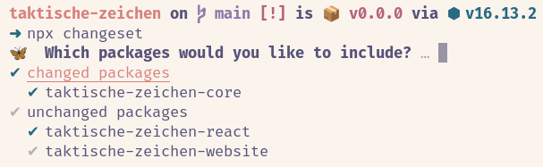
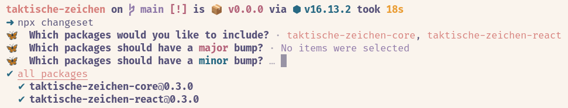

# Contributors' Guide

Vielen Dank, dass du an der Entwicklung der Taktischen Zeichen mitarbeiten möchtest! Diese Anleitung hilft dir hoffentlich dabei.

## Voraussetzungen

Du benötigst [Node 16](https://nodejs.org/en/download/). Fertig. Wir empfehlen [Volta](https://volta.sh/).

## Installation

```bash
npm ci
npm bootstrap
```

## Bauen

```bash
npm run build
```

## Website lokal testen

```bash
npm run dev
```

Öffne http://localhost:8000. Alle Änderungen an Source-Dateien werden automatisch in der Website aktualisisert, das dauert aber ein paar Sekunden.

## Pull Requests

Wir verwenden [Changesets](https://github.com/changesets/changesets) für unser Changelog und die Versionierung unserer Pakete.

Wenn du einen PR erstellst, füge bitte auch ein Changeset hinzu:

```bash
npx changeset
```

Wähle die beiden Repositories `taktische-zeichen-core` und `taktische-zeichen-react` aus, auch wenn du in letzterem keine Änderung gemacht hast. Wähle _nicht_ `taktische-zeichen-website` aus.



Wähle nun aus, welche Pakete durch deine Änderung einen `major` oder `minor` oder `patch` Versionssprung erhalten sollen.

- `major`: Die API hat sich so verändert, das bisherige Benutzer nun einen Fehler erhalten werden. Dies ist insbesondere der Fall, wenn du Elemente _entfernt_ hast.
- `minor`: Du hast neue Elemente oder Funktionen hinzugefügt. Benutzer erhalten keinen Fehler, wenn sie die neue Version einfach aktualisieren.
- `patch`: Du hast ein bestehendes Element korrigiert oder leicht verändert oder die Beschreibung geändert.



Committe die neu erstellte Datei unter `.changeset` mit in deinen PR.

Wenn alles gut gelaufen ist, erhälst du automatisch einen Kommentar in deinem PR, welche Packages durch deine Änderung eine neue Version erhalten werden.

## Statistiken

Wenn du ein neues Element hinzufügst oder eines entfernst, passe bitte die Statistiken in den folgenden Dateien an:

- [`README.md`](README.md)
- [`packages/core/README.md`](packages/core/README.md)
- [`packages/react/README.md`](packages/react/README.md)
